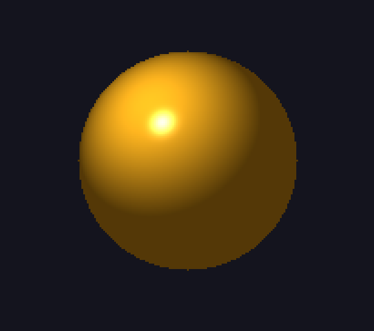
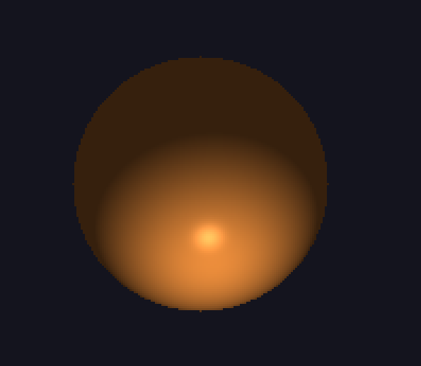
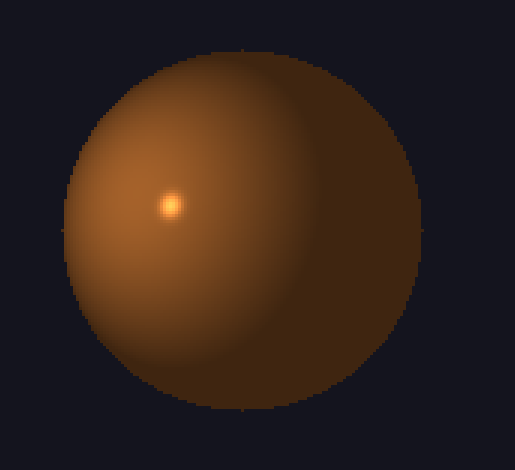
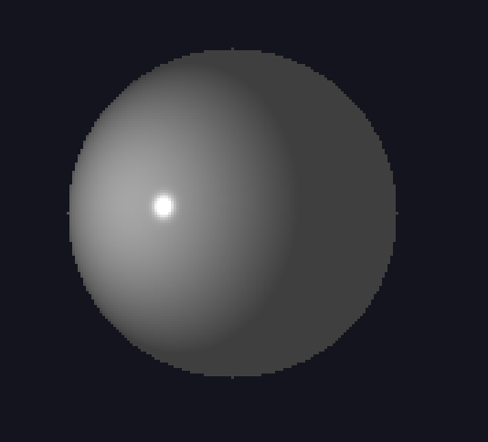
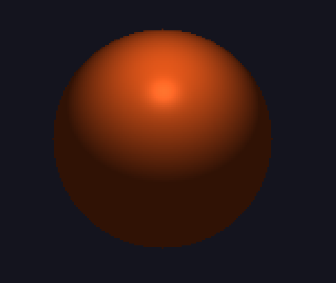
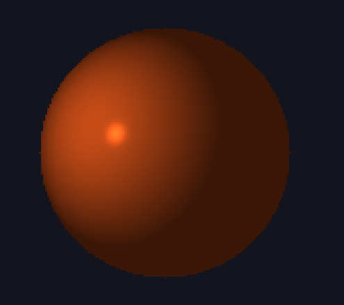
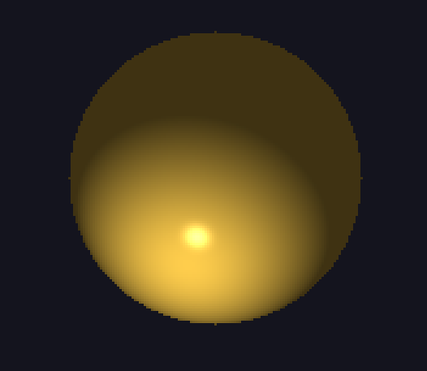
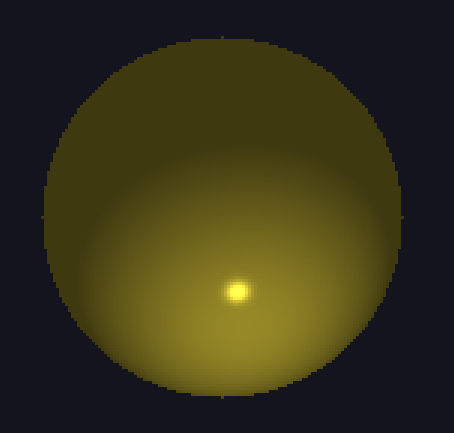
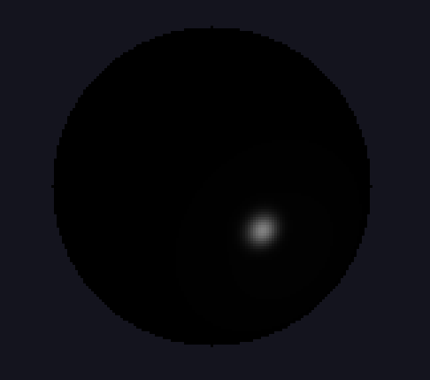
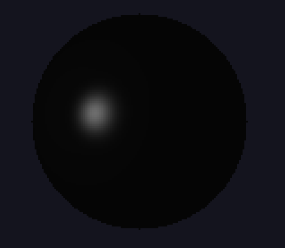

# Sprawozdanie z projektu
### Temat: Wykorzystanie oświetlenia do demonstracji właściwości materiałowych
## Cel projektu
Celem projektu było stworzenie interaktywnej demonstracji komputerowej, która pozwala na wizualizację wpływu różnych właściwości materiałowych na wygląd obiektu oświetlanego punktowym źródłem światła. Program umożliwia zmianę parametrów materiału w czasie rzeczywistym i obserwację efektów tych zmian.

## Opis działania programu
Aplikacja została napisana w języku Python z wykorzystaniem bibliotek NumPy, Pillow oraz Tkinter. Program generuje animowaną scenę 2D, w której wyświetlana jest kula oświetlana przez poruszające się źródło światła.

## Model oświetlenia
Do obliczeń wykorzystano uproszczony model Phonga, który uwzględnia trzy składowe światła:  

Ambient (otoczenia) – światło rozproszone w scenie,  
Diffuse (rozproszone) – światło odbite od powierzchni w zależności od kąta padania,  
Specular (lustrzane) – światło odbite w sposób kierunkowy, odpowiadające za połysk.  
Parametry materiału (ambient, diffuse, specular) są definiowane jako osobne wartości dla każdej składowej koloru w przestrzeni RGB z pojedyńczą wartością połysku.  

## Interfejs użytkownika
Wyświetlanie: Okno aplikacji wyświetla kulę, której wygląd zmienia się w zależności od wybranego materiału i pozycji światła.
Sterowanie:
Klawisze 0-9 - zmiana materiału kuli,
Spacja – pauza/wznowienie animacji,
Escape – zamknięcie programu.

## Materiały i wyniki

Mosiądz  
  

Brąz  
  

Polerowany brąz  
  

Chrom  
  

Miedź  
  

Polerowana miedź  
  

Złoto  
  

Polerowane złoto  
  

Czarny plastik  
  

Czarna guma  
  

## Wyniki i obserwacje
Zmiana parametrów materiału pozwala zaobserwować:

Różnice w połysku (np. polerowane metale mają wyraźny refleks świetlny, guma jest matowa),  
Zmiany w kolorze odbitego światła,  
Wpływ światła otoczenia na widoczność obiektu.  
Animacja ruchomego światła pozwala dodatkowo zobaczyć, jak zmienia się rozkład światła i cienia na powierzchni w zależności od położenia źródła światła.

## Wnioski
Model Phonga pozwala na pewien stopień odzwierciedlenia właściwości materiałów, chociaż pozostawia wiele do życzenia i w zależności od symulowanego materiału może produkować różnej jakości rezultaty. Jest to widoczne na przykładzie złota, które pozostawia wiele do życzenia, podczas gdy materiały zaliczające się do ogólnej, nieokreślonej grupy jak czarny plastik i guma są bardziej wiarygodne.

